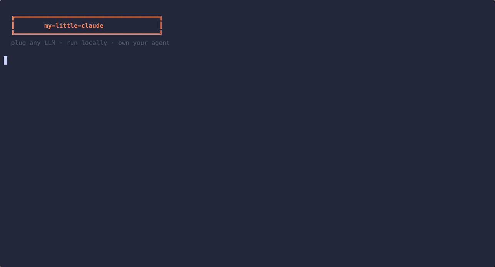

<div align="center">


<h1>my-little-claude</h1>



<p><b>A model-agnostic coding agent harness in Rust.<br/>Plug any LLM. Run locally. Own your agent.</b></p>

<p>
  <a href="#features"><strong>Features</strong></a> ·
  <a href="#quick-start"><strong>Quick Start</strong></a> ·
  <a href="#architecture"><strong>Architecture</strong></a> ·
  <a href="#extend"><strong>Extend</strong></a> ·
  <a href="#roadmap"><strong>Roadmap</strong></a>
</p>

<p>

[](https://www.rust-lang.org)
[](LICENSE)
[](https://github.com/UnripePlum/my-little-claude/actions)
[]()

</p>

</div>

---

my-little-claude is both a **working coding agent** and a **crate ecosystem** for building your own.

Three providers (Anthropic, OpenAI, ollama), five tools, MCP plugin support, a tiered permission system, and session persistence. Swap models with a flag. Add custom providers, tools, or permission policies by implementing a trait.

## Features

- **Interactive REPL** -- conversational loop with `/undo`, `/clear`, `/save`, `/skills` commands
- **3 providers built-in** -- Anthropic Claude, OpenAI GPT, local ollama. Or implement `LlmProvider` for anything.
- **8 tools** -- `read_file`, `write_file`, `edit_file`, `bash`, `glob`, `grep`, `web_fetch`, `web_search`. Extensible via the `Tool` trait.
- **Streaming ReAct loop** -- tool calls and text stream in real-time with `stream_turn()`
- **Tiered permission system** -- reads auto-allowed, writes need approval, or `--no-permission` for no guardrails
- **Checkpoints** -- automatic file backup before edits, `/undo` to restore
- **Hooks system** -- `pre_tool_use` / `post_tool_use` shell commands for automation
- **Skills system** -- reusable markdown prompts from `.unripe/skills/` as `/skill-name` commands
- **Session persistence** -- conversations save to disk, resume with `--resume`
- **Auto-setup** -- `unripe setup` detects your hardware and downloads the right local model
- **Non-interactive mode** -- `--print` for CI/scripting, `--yes` for auto-approve
- **MCP plugin support** -- compatible with Claude Code's `.mcp.json`, extend with any MCP server
- **Local-first** -- run with ollama, no API key, no internet required

## Quick Start

```bash
cargo install unripe-cli
```

Or build from source:

```bash
git clone https://github.com/UnripePlum/my-little-claude
cd my-little-claude
cargo build --release
# Binary at target/release/unripe
```

**Option A: Local model (no API key needed)**

```bash
unripe setup                                    # detect hardware, download best model
unripe "describe what this repo does"           # run the agent
```

**Option B: Cloud API**

```bash
export ANTHROPIC_API_KEY=sk-ant-...
unripe "fix the bug in main.rs"

export OPENAI_API_KEY=sk-...
unripe --provider openai --model gpt-4o "refactor this function"

unripe --provider ollama --model qwen3.5:9b "add error handling"
```

**Interactive REPL:**

```bash
unripe                                          # enter interactive mode
unripe> fix the bug in main.rs
unripe> /undo                                   # undo last file edit
unripe> /skills                                 # list available skills
unripe> /exit
```

**More:**

```bash
unripe --resume "continue where we left off"    # resume session
unripe --chat "explain this code"               # chat-only, no tools
unripe --print "what does this do" | head       # CI/scripting mode
unripe --no-permission "refactor everything"    # no guardrails
unripe sessions                                 # list saved sessions
unripe replay <id> --model qwen3.5:9b           # replay with different model
```

## Architecture

```
                          ┌─────────────┐
                          │  unripe-cli │
                          │   (clap)    │
                          └──────┬──────┘
                                 │
                    ┌────────────┼────────────┐
                    │            │             │
             ┌──────▼───────┐   │   ┌─────────▼────────┐
             │ unripe-setup │   │   │   unripe-engine   │
             │              │   │   │                   │
             │ sysinfo      │   │   │  ReAct Loop:      │
             │ recommend    │   │   │  prompt → LLM     │
             │ download     │   │   │  → tool use?      │
             └──────────────┘   │   │    → permission?  │
                                │   │    → execute      │
                                │   │  → stream text    │
                                │   └──┬──────┬───┬─────┘
                                │      │      │   │
                          ┌─────▼──┐  ┌▼──────┴───▼────┐
                          │ tools  │  │   providers     │
                          │        │  │                 │
                          │ read   │  │  anthropic      │
                          │ write  │  │  openai         │
                          │ bash   │  │  ollama         │
                          │ glob   │  │  (your own)     │
                          │ grep   │  │                 │
                          │ + MCP  │  └───┬─────────────┘
                          └───┬────┘      │
                              │           │
                          ┌───▼───────────▼───┐
                          │    unripe-core     │
                          │                    │
                          │ LlmProvider trait   │
                          │ Tool        trait   │
                          │ PermissionGate trait│
                          │ Message, Session,   │
                          │ Config types        │
                          └────────────────────┘
```

### Crate Map

| Crate | What it does |
|-------|-------------|
| **unripe-core** | Traits (`LlmProvider`, `Tool`, `PermissionGate`) and shared types |
| **unripe-engine** | Agent loop: bootstrap, ReAct cycle, session truncation, guards |
| **unripe-providers** | Anthropic (streaming SSE), OpenAI (chat completions), ollama (local) |
| **unripe-tools** | `read_file`, `write_file`, `bash` (timeout), `glob`, `grep` |
| **unripe-setup** | Hardware detection, model recommendation, ollama download |
| **unripe-mcp** | MCP client: load `.mcp.json`, connect to servers, bridge tools into agent |
| **unripe-cli** | Binary entry point with clap, permission prompts, colored output |

## How It Works

```
User: "fix the bug in main.rs"
  │
  ▼
Bootstrap
  Load CLAUDE.md, AGENTS.md, git branch → system prompt
  │
  ▼
Agent Loop (max 25 turns)
  │
  ├─▶ Send messages + tool definitions to LLM
  │
  ├─▶ LLM returns tool_use(read_file, {path: "main.rs"})
  │     ├─ PermissionGate: FileRead inside project → Allow
  │     ├─ Execute read_file → Success("fn main() { ... }")
  │     └─ Append tool result to messages
  │
  ├─▶ LLM returns tool_use(write_file, {path: "main.rs", content: "..."})
  │     ├─ PermissionGate: FileWrite → Ask
  │     ├─ Terminal: "[Permission] Write file: main.rs [y/N]"
  │     ├─ User types: y
  │     ├─ Execute write_file → Success("Written 142 bytes")
  │     └─ Append tool result to messages
  │
  └─▶ LLM returns text("Fixed the bug. The issue was...")
        └─ Stream to terminal, save session, done.
```

## Permission System

| Action | Inside project | Outside project |
|--------|:---:|:---:|
| `read_file` | Allow | Ask |
| `write_file` | Ask | **Deny** |
| `bash` | Ask | Ask |
| `glob` / `grep` | Allow | Ask |

Implement `PermissionGate` for custom policies:

```rust
use unripe_core::permission::{PermissionGate, Permission, ToolAction};

struct MyGate;
impl PermissionGate for MyGate {
    fn check(&self, tool_name: &str, action: &ToolAction) -> Permission {
        match action {
            ToolAction::BashExec(cmd) if cmd.contains("rm") => {
                Permission::Deny("no delete commands".into())
            }
            _ => Permission::Allow,
        }
    }
}
```

## Configuration

`~/.unripe/config.toml`:

```toml
[agent]
max_turns = 25           # Stop after N turns
token_budget = 100000    # Stop after ~N tokens
bash_timeout_secs = 30   # Kill bash after N seconds
context_files = []       # Extra files to load as context

[provider]
default_provider = "ollama"
default_model = "qwen3.5:9b"

[provider.anthropic]
api_key_env = "ANTHROPIC_API_KEY"

[provider.openai]
api_key_env = "OPENAI_API_KEY"
# base_url = "https://api.together.xyz"  # OpenAI-compatible APIs

[provider.ollama]
base_url = "http://localhost:11434"
```

> [!TIP]
> Run `unripe setup` to auto-generate this config with the best model for your hardware.

## <a name="extend"></a>Extend

### Add a Provider

```rust
use unripe_core::provider::{LlmProvider, TurnConfig, TurnResponse, StreamEvent};
use unripe_core::message::Message;
use unripe_core::tool::ToolDefinition;

#[async_trait::async_trait]
impl LlmProvider for MyProvider {
    fn name(&self) -> &str { "my-provider" }

    async fn send_turn(
        &self, messages: &[Message], tools: &[ToolDefinition], config: &TurnConfig,
    ) -> anyhow::Result<TurnResponse> {
        // call your LLM API, return TurnResponse::Text or TurnResponse::ToolCalls
        todo!()
    }

    async fn stream_turn(
        &self, messages: &[Message], tools: &[ToolDefinition], config: &TurnConfig,
    ) -> anyhow::Result<Pin<Box<dyn Stream<Item = StreamEvent> + Send>>> {
        // yield StreamEvent::TextDelta, ToolCallStart, etc.
        todo!()
    }
}
```

### Add a Tool

```rust
use unripe_core::tool::{Tool, ToolContext, ToolResult};

#[async_trait::async_trait]
impl Tool for MyTool {
    fn name(&self) -> &str { "my_tool" }
    fn description(&self) -> &str { "Does something useful" }
    fn schema(&self) -> serde_json::Value {
        serde_json::json!({
            "type": "object",
            "properties": { "input": { "type": "string" } },
            "required": ["input"]
        })
    }

    async fn execute(&self, input: serde_json::Value, ctx: &ToolContext) -> anyhow::Result<ToolResult> {
        let val = input["input"].as_str().unwrap_or("");
        Ok(ToolResult::Success(format!("processed: {val}")))
    }
}
```

## Safety

| Guard | Default | Configurable |
|-------|---------|:---:|
| Max conversation turns | 25 | `config.toml` |
| Token budget | 100,000 | `config.toml` |
| Bash timeout | 30s | `config.toml` |
| Write outside project | **Blocked** | `PermissionGate` |
| Bash execution | **Requires approval** | `PermissionGate` |
| Session truncation | Keep last 10 messages | `config.toml` |
| Ctrl+C | Kills child processes, exits | -- |

## Development

```bash
# Setup
git config core.hooksPath .githooks   # pre-commit: fmt + clippy + test

# Test
cargo test --workspace                 # 187 tests across 7 crates
cargo test -p unripe-core              # Core traits (42 tests)
cargo test -p unripe-engine            # Engine + checkpoints (19 tests)
cargo test -p unripe-providers         # 3 providers + SSE (39 tests)
cargo test -p unripe-tools             # 8 tools (52 tests)
cargo test -p unripe-setup             # Hardware detection (29 tests)
cargo test -p unripe-mcp              # MCP client (6 tests)

# Lint
cargo clippy --workspace -- -D warnings
cargo fmt --all -- --check
```

## Roadmap

### v0.3 (current)

- ~~Interactive REPL~~ ✓
- ~~Edit tool~~ ✓
- ~~Hooks system~~ ✓
- ~~CLAUDE.md 4-level hierarchy~~ ✓
- ~~Skills system~~ ✓
- ~~Checkpoints + /undo~~ ✓
- ~~Non-interactive mode (`--print`)~~ ✓
- ~~WebFetch/WebSearch tools~~ ✓
- ~~`--no-permission` flag~~ ✓

### v0.4 (next)

- Sub-agents -- split complex tasks into parallel workstreams
- Streaming output -- real-time token streaming in REPL
- Context window management -- smarter truncation with summarization
- Plugin marketplace -- discover and install community skills
- Multi-file edit -- atomic edits across multiple files

## License

[MIT](LICENSE) OR Apache-2.0
